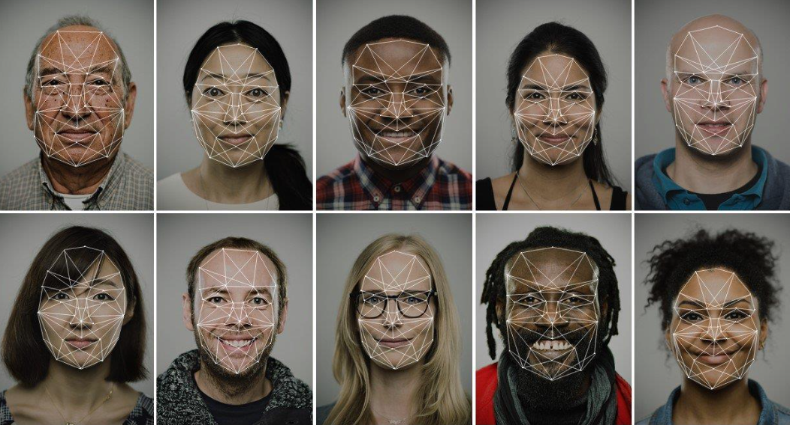

According to the images that have been seen and learned from different people, identify the image that belongs to one of the previous people but taken from different angles and with different facial expressions.

In this project, we are not going to use the concepts of machine learning.
We make a simple face recognition system by only using the concept and powerful tool of SVD, as well as the concept of vector space and subspace.